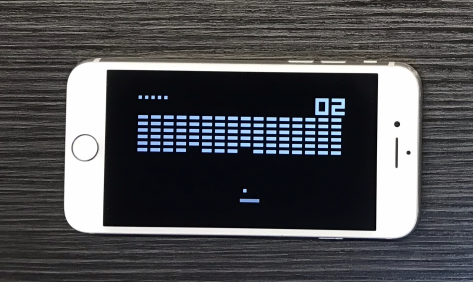

# Pongo BRIX

A pongoOS module for running the BRIX game, featuring rendering code I wrote at 1 AM and the CHIP-8 emulator I made 2 years earlier when I was scared of bitwise operations apparently



# Usage

## Before you begin

**Warning:** This project was intended to be compiled on macOS. If you're using Linux, you will have to modify the makefile and you might need to use something other than `pongoterm`.

- Clone PongoOS to ../pongoOS like this: `git clone --recursive https://github.com/checkra1n/PongoOS.git ../pongoOS`

## Compatibility

Currently supported devices:
- iPhone 7 GSM (iPhone9,3)
- iPad Pro 10.5-inch WiFi/Cellular (iPad7,4)
- iPad 10.2-inch 7th Gen WiFi/Cellular (iPad7,12)
- iPhone SE (1st generation) (iPhone8,4)

If your device is already supported, great! You won't have to modify the code. You can skip to [running BRIX](#running-brix). If your device isn't supported, adding support for your own device shouldn't be hard.

## Adding support for your device

Different devices use different addresses for buttons and there doesn't appear to be an automatic way to extract these addresses from the device. However, you can use `button_helper` in this repository to manually find the button addresses for your device.

1. With your device plugged in, run `make start_pongoos_shell`. This will open a pongoOS shell, where you can then run `/send button_helper.bin` and then `modload`. If you don't have button_helper.bin, run `make button_helper.bin` and try again.
2. In the pongoOS shell, run `button_helper`.
3. Follow the instructions given by the program. "Holding the mute switch" means muting and releasing it means unmuting. Example output:
```
pongoOS> button_helper

Device: iPad7,4

Get ready.
Hold "volume_down".
Release "volume_down" and keep it released.
Address: 0x20f1000ac

Get ready.
Hold "volume_up".
Release "volume_up" and keep it released.
Address: 0x20f1000a0

...
```
4. In `main.c`, add the values printed by this program. For the buttons your device doesn't have, specify `NULL`. If the program failed to identify any of the buttons, you can re-run the program until it finds the correct addresses. **Make sure you place your values before `{ .name = NULL }` since anything that comes after that will be ignored.**
5. BRIX should now work on your device! You can now [run BRIX](#running-brix).

## Running BRIX

1. Run `make load_pongoos_shell`. This will load the pongo_os shell where you can then run `/send brix.bin` and then `modload`. If you don't have brix.bin, run `make brix.bin` and try again.
2. Run `brix` in the pongoOS shell. Your device should now be running BRIX.

## Controls

- **Movement:** vol+, vol-
- **Reset:** Press the power button while not paused.
- **Pause:** If your device has a mute switch, mute to pause. Otherwise, you can use the home button to pause. The game will remain paused for as long as you hold the home button.
- **Exit:** Press the power button while paused.
